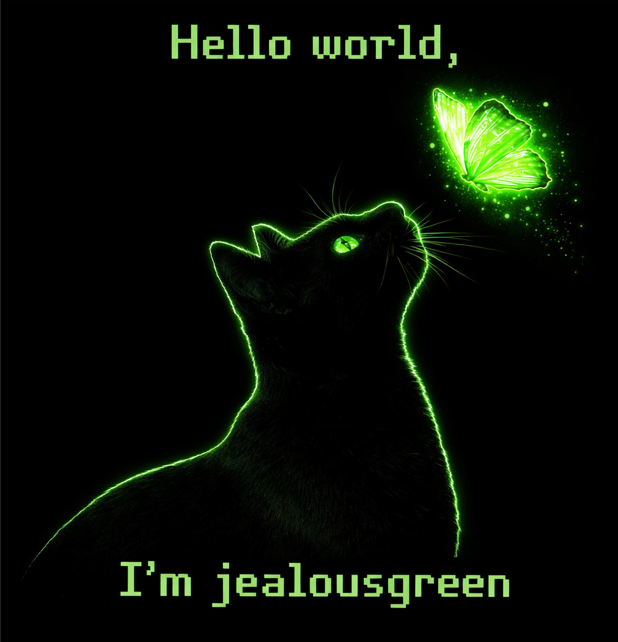

  

I'm a **Software Engineering student** and a **PL/SQL Developer** working with relational databases. 

## 🎓 About Me
- 🎓 Software Engineering student
- 💼 Working as a PL/SQL Developer
- 🗄 Focused on database development and optimization
- 🔐 Interested in information security and cryptography

---
<!--
**jealousgreen/jealousgreen** is a ✨ _special_ ✨ repository because its `README.md` (this file) appears on your GitHub profile.

Here are some ideas to get you started:

- 🔭 I’m currently working on ...
- 🌱 I’m currently learning ...
- 👯 I’m looking to collaborate on ...
- 🤔 I’m looking for help with ...
- 💬 Ask me about ...
- 📫 How to reach me: ...
- 😄 Pronouns: ...
- ⚡ Fun fact: ...
-->
